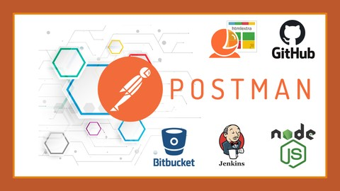

 

<h1 align="center"> Udemy - Automação de Testes de API com Postman </h1>

O curso de Automação de Testes de API com Postman, ministrado pelo professor Erick Valentin, ensina desde os fundamentos desta poderosa ferramenta para testes de APIs, como também criar e gerenciar workspaces colaborativos, ambientes, coleções, criar scripts de pré requisição, scripts de testes e gerar documentação de testes no Postman.

 

  

 

  <a href="#-tecnologias">🚀 Tecnologias</a>&nbsp;&nbsp;&nbsp;|&nbsp;&nbsp;&nbsp;
  <a href="#-certificado">📜 Certificado</a>&nbsp;&nbsp;&nbsp;|&nbsp;&nbsp;&nbsp;
  <a href="#memo-licença">:memo: Licença</a>

 

## 🚀 Tecnologias

Neste curso foi utilizada a seguinte tecnologia:

 

## 📜 Certificado

Conclusão do Curso: 10/08/2023

  

 

## :memo: Licença

Esse projeto está sob a licença MIT.

---

Desenvolvido por [Thiago Honorato](https://www.linkedin.com/in/honoratothiago/)
